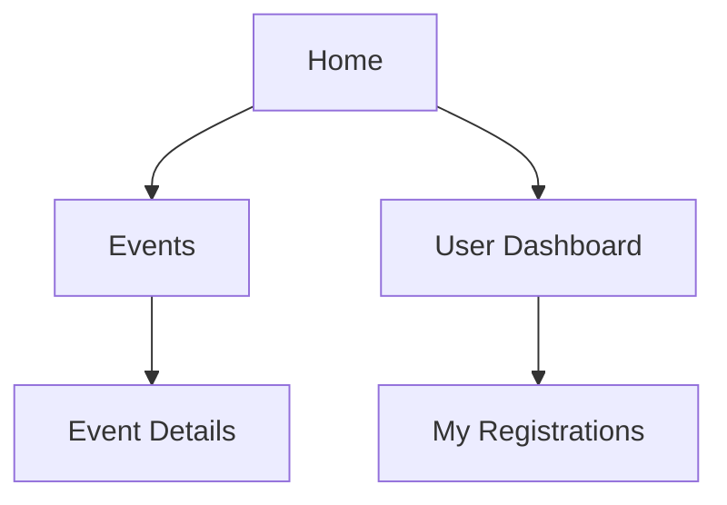

# Prompt: Medellin AI Event Platform Sitemap Generation

## Objective

Generate a comprehensive, user-centered sitemap for the Medellin AI Event Platform that follows industry best practices for event management platforms. The sitemap should serve as a strategic blueprint for organizing all platform content and functionality, ensuring intuitive navigation for all user types while supporting the platform's business goals and technical requirements.

## Context

The Medellin AI Event Platform is designed to serve as a central hub for AI-focused events in Medellin, Colombia. The platform needs to support multiple user roles (attendees, event organizers, speakers, sponsors) and various event types (conferences, workshops, networking sessions, hackathons) while providing a seamless, bilingual experience optimized for both desktop and mobile devices.

## Sitemap Requirements

### 1. Comprehensive Project Analysis

Before creating the sitemap:

- Review all available project documentation to identify key platform features and requirements
- Consider the unique needs of the Colombian market and AI event industry
- Analyze user personas and journeys for different stakeholder types
- Identify primary conversion paths and business objectives

### 2. Sitemap Structure

Provide the sitemap in two complementary formats:

#### Visual Hierarchy

Create a visual representation showing the complete site architecture with:

- Clear parent-child relationships
- Page groupings and sections
- Navigation paths and cross-linking
- User role-specific sections

Use markdown-compatible format (can use mermaid diagrams):

#### Detailed Page Inventory

Provide a comprehensive list of all pages with:

- Page name
- URL structure recommendation
- Primary purpose
- Key components
- User roles with access
- Content priority
- SEO considerations

### 3. User Role Considerations

Address navigation paths and access requirements for each user type:

- **Event Attendees**: Discovery, registration, personal schedule management
- **Event Organizers**: Event creation, management, analytics
- **Speakers/Presenters**: Profile management, presentation uploads, schedules
- **Sponsors**: Sponsorship options, brand presence, lead generation
- **Administrators**: Platform management, user administration, content moderation

### 4. Core Functional Areas to Include

Ensure the sitemap addresses these essential sections:

1. **Public-Facing Pages**

   - Homepage (with featured events, categories, and search)
   - Event discovery (browsing, filtering, searching)
   - Event details (agenda, speakers, location, registration)
   - Speaker/presenter profiles
   - About/Company information
   - Help/Support resources
   - Blog/Resources section
   - Contact information

2. **User Account Section**

   - Registration/Login
   - User profile management
   - Saved events/Wishlist
   - Purchased tickets/Registrations
   - Personal schedule
   - Notification preferences
   - Payment methods/History

3. **Organizer Dashboard**

   - Event creation and management
   - Attendee management
   - Speaker coordination
   - Sponsor management
   - Analytics and reporting
   - Financial tracking
   - Marketing tools

4. **Administrative Functions**
   - User management
   - Content moderation
   - System configuration
   - Analytics and reporting
   - Integration management

### 5. Mobile Considerations

Address mobile-specific navigation:

- Prioritization of key functions for mobile users
- Adaptation of navigation patterns for small screens
- Touch-friendly interaction patterns
- Progressive disclosure of complex information

### 6. Localization Structure

Detail how the sitemap accommodates:

- Bilingual content (Spanish/English)
- URL structure for language variants
- Cultural considerations for Colombian users
- Region-specific functionality

### 7. Search Engine Optimization

Include SEO best practices:

- Logical URL hierarchy
- Semantic structure recommendations
- Breadcrumb navigation implementation
- Sitemap.xml considerations
- Structured data opportunities

## Best Practices to Apply

Incorporate these sitemap best practices:

1. **Information Architecture**

   - Limit main navigation items to 7±2 options
   - Keep page hierarchy to maximum 3-4 levels deep
   - Group related content logically
   - Use clear, descriptive naming conventions

2. **User Experience**

   - Apply the "three-click rule" for critical functions
   - Ensure consistent navigation patterns
   - Provide multiple pathways to important content
   - Consider search as a primary navigation method

3. **Event Platform Specific**

   - Prioritize event discovery and registration flows
   - Support time-based navigation (upcoming events)
   - Consider geographical navigation (event locations)
   - Account for event lifecycle states (upcoming, active, past)

4. **Technical Considerations**
   - Support for dynamic content generation
   - Pagination and infinite scroll strategies
   - Component reuse across multiple page types
   - State management for interactive elements

## Deliverable Format

The sitemap should include:

1. **Executive Summary**

   - Overview of approach and key organizational principles
   - Primary user flows and conversion paths
   - Key recommendations and rationale

2. **Visual Sitemap**

   - Complete hierarchical representation
   - Color-coding for different sections/user roles
   - Connection indicators for cross-section linking

3. **Page Inventory**

   - Comprehensive table of all pages
   - Metadata for each page
   - Notes on dynamic content and states

4. **User Journeys**

   - Key paths for primary user stories
   - Critical conversion funnels

5. **Implementation Notes**
   - Navigation component recommendations
   - URL structure guidelines
   - Breadcrumb implementation
   - Search functionality recommendations

## Examples for Inspiration

Consider these patterns from successful event platforms:

1. **Eventbrite's** category-driven discovery with geographic filtering
2. **Meetup's** interest-based grouping and recommendations
3. **Hopin's** virtual event navigation and engagement tools
4. **Conference Compass's** personalized agenda building
5. **Cvent's** comprehensive organizer dashboard organization

The final sitemap should balance comprehensive functionality with intuitive navigation, creating a foundation for an event platform that serves both Colombian and international users in the AI industry space.
