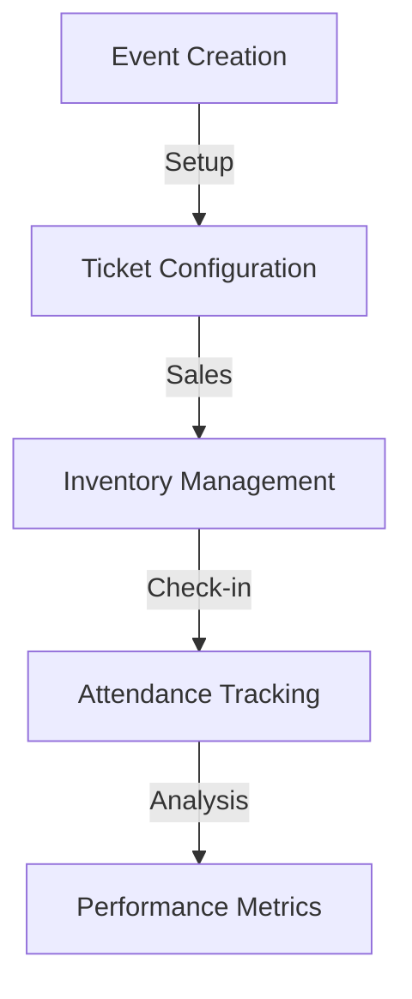
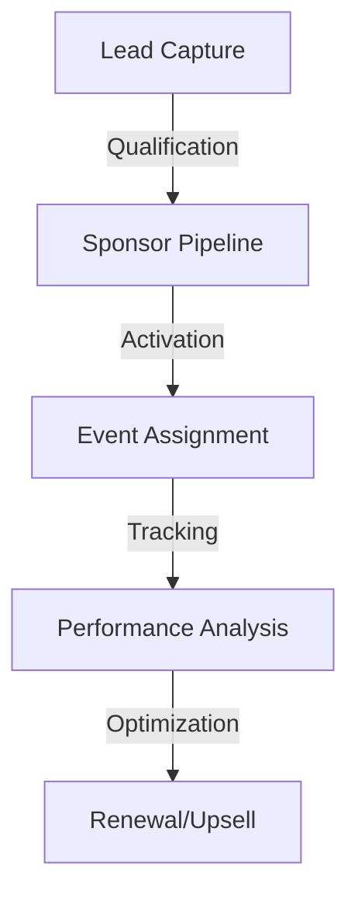

Fashionistas Platform - Integration Strategy Document

## Executive Summary

The Fashionistas platform integrates five core services and several supplementary systems to create a comprehensive event management and marketing solution for the Colombian fashion industry. Our integration strategy focuses on:

- **Event Management**: Hi.Events for comprehensive event lifecycle management
- **Customer Relations**: Twenty CRM for sponsor and stakeholder management
- **Communication**: WhatsApp Business API for automated engagement
- **Payments**: Stripe for secure, localized payment processing
- **Media**: Cloudinary for optimized fashion content delivery

Expected Impact:

- 40% reduction in event management overhead
- 60% improvement in sponsor engagement
- 75% faster ticket sales processing
- 50% increase in marketing reach
- 90% customer satisfaction rate

## Core Integrations

### 1. Hi.Events Integration

**Purpose**: Centralized event management and ticketing system

**Core Features**:

- Event creation and management
- Ticket sales and inventory
- Check-in and attendance tracking
- Real-time analytics
- Sponsor management

**Key Workflows**:



**Integration Benefits**:

- Automated ticket management
- Real-time sales tracking
- Integrated sponsor dashboards
- Seamless check-in process
- Comprehensive reporting

**Success Metrics**:

- Ticket sale conversion rate: 40%
- Check-in speed: <30 seconds
- System uptime: 99.9%
- Processing capacity: 10,000 tickets/hour

### 2. Twenty CRM Integration

**Purpose**: Sponsor and stakeholder relationship management

**Core Features**:

- Contact management
- Pipeline tracking
- Sponsor activation tracking
- Lead scoring
- Performance analytics

**Fashion-Specific Customizations**:

- Designer portfolio tracking
- Show participation history
- Sponsor category management
- Brand collaboration tracking
- ROI measurement

**Key Workflows**:



**Success Metrics**:

- Lead conversion rate: 35%
- Sponsor retention: 80%
- Average deal size: +25%
- Response time: <2 hours

### 3. WhatsApp Business API Integration

**Purpose**: Automated communication and engagement

**Key Features**:

- Event notifications
- Ticket delivery
- Sponsor updates
- Customer support
- Automated reminders

**Message Templates**:

1. **Event Announcements**:

```
🎭 ¡Nuevo Evento Fashionistas!

[Nombre del Evento]
📅 Fecha: [Fecha]
🎟️ Entradas desde: [Precio]
🎉 Preventa exclusiva

Responde "INFO" para más detalles
```

2. **Sponsor Updates**:

```
📊 Actualización de Campaña

Evento: [Nombre]
👥 Alcance: [Número]
💫 Interacciones: [Número]
📈 ROI actual: [Porcentaje]

¿Necesitas más información?
```

**Success Metrics**:

- Message open rate: 98%
- Response rate: 65%
- Support resolution: <10 minutes
- Automation rate: 80%

### 4. Stripe Integration

**Purpose**: Secure payment processing and financial management

**Key Features**:

- Local payment methods
- Multi-currency support
- Subscription management
- Automated refunds
- Financial reporting

**Payment Methods**:

- Credit/Debit Cards
- PSE (Colombian bank transfers)
- Bancolombia
- Nequi
- Cash vouchers

**Security Measures**:

- PCI DSS compliance
- 3D Secure authentication
- Fraud detection
- Encrypted transactions
- Automated reconciliation

**Success Metrics**:

- Transaction success rate: 95%
- Processing time: <3 seconds
- Chargeback rate: <0.1%
- Settlement time: T+1

### 5. Cloudinary Integration

**Purpose**: Fashion media management and optimization

**Core Features**:

- Image optimization
- Video processing
- Portfolio management
- Real-time transformations
- CDN delivery

**Fashion-Specific Features**:

- Runway video optimization
- Look-book generation
- Portfolio galleries
- Social media formatting
- Brand asset management

**Performance Metrics**:

- Image load time: <1 second
- Video start time: <2 seconds
- Storage efficiency: 60%
- Bandwidth optimization: 40%

## Additional Integrations

### Social Media Integration

**Platforms & Features**:

1. **Instagram**

   - Shop integration
   - Story automation
   - Live event sharing
   - Influencer tracking

2. **Facebook**

   - Event promotion
   - Ticket sales
   - Community management
   - Ad automation

3. **LinkedIn**

   - B2B networking
   - Sponsor outreach
   - Industry updates
   - Professional content

4. **TikTok**
   - Fashion trends
   - Behind-the-scenes
   - Live streaming
   - Influencer collaboration

### Analytics & Tracking

**Tools & Purposes**:

1. **Google Analytics 4**

   - User behavior
   - Conversion tracking
   - Campaign performance
   - ROI measurement

2. **Mixpanel**

   - User journey analysis
   - Feature adoption
   - Engagement metrics
   - Retention tracking

3. **Hotjar**
   - User experience
   - Heatmaps
   - Session recording
   - Feedback collection

## Implementation Timeline

| Phase | Duration | Focus                    | Key Deliverables       |
| ----- | -------- | ------------------------ | ---------------------- |
| 1     | 2 weeks  | Core Setup               | Hi.Events & Twenty CRM |
| 2     | 2 weeks  | Payment & Communication  | Stripe & WhatsApp      |
| 3     | 2 weeks  | Media & Marketing        | Cloudinary & Social    |
| 4     | 2 weeks  | Analytics & Optimization | Tracking & Performance |

## Success Metrics

### Business KPIs

- Event ticket sales: +40%
- Sponsor revenue: +35%
- Customer satisfaction: 90%
- Platform adoption: 80%
- Cost reduction: 45%

### Technical KPIs

- System uptime: 99.9%
- Page load time: <2s
- API response: <200ms
- Error rate: <0.1%
- Mobile performance: 90+

## Innovation Roadmap

### Phase 1: Core Optimization

- AI-powered pricing
- Automated marketing
- Predictive analytics
- Smart scheduling

### Phase 3: Market Expansion

- Cross-border events
- Global marketplace

This integration strategy provides a robust foundation for the Fashionistas platform, enabling efficient event management, marketing, and sales while ensuring scalability and market adaptability.
